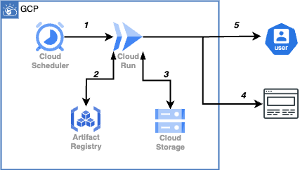
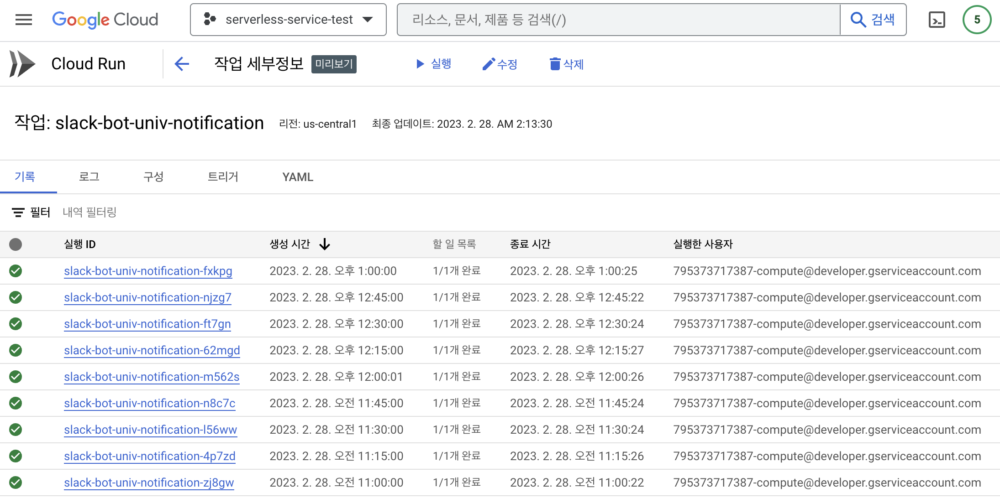
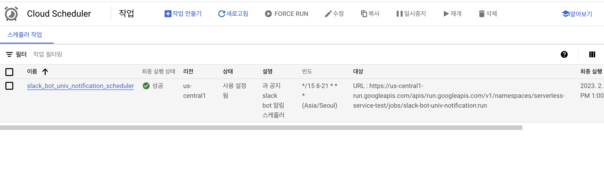
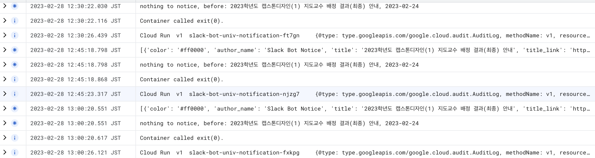

# slackbot - 학과 공지 알리미

# Introduction
학과 공지를 놓치는 많은 학우를 위해서 간단하게 만든 사이드 프로젝트  

# Abstract
학교 공지는 학교 알리미 앱을 통해서 놓치지 않지만, 학과의 공지들은 알림이 오는 경우가 적다. 학과 공지에는 장학금, 대회, 캡스톤 디자인, BEAR 프로그램 지원, 연구실 모집 등의 중요한 정보가 있음에도 놓치는 경우가 많다.  
이를 개선하기 위해서 동아리 협업도구로 사용하고 있는 slack을 이용하여 학우들에게 자동으로 정보를 제공하고자 하는 사이드 프로젝트를 기획했다.  
(2023.02.28) ver 1.1.0 -> GCP Cloud Run Tasks, Cloud Storage 및 Cloud Scheduler 사용로 변경
(2024.03.19) GCP 정책 업데이트로, Cloud Container Registry -> Cloud Artifact Registry로 Migration (https://yureutae-log.vercel.app/artifact-registry-migration)
.

# implementation

1. Slack API를 활용하여 notification channel을 따로 판다. (토큰 등을 할당받아야 함. slack_bot.py에서 토큰 값 수정)
2. python request, bs4 모듈을 사용하여 학과 사이트에서 정보를 가져온다.
3. 최근 정보만 pickle로 저장한 후 주기적으로 이후 공지와 비교해서, 동일하면 공지 x 다르다면 새로 공지하는 구조를 만든다.    
4. python 프로젝트 파일을 실행할 bash 파일을 생성.
5. 해당 프로젝트 파일 또는 컨테이너 이미지를 서버 등에 업로드 .    
6. linux crontab 또는 scheduler를 활용하여 주기적으로 실행 

에브리타임에 신입생을 위하여 누군가 디스코드 알림 앱을 만든 것을 보고 사이드 프로젝트를 기획하였다. 작성된 디스코드 알림 앱의 단점으로는 1. 스케줄 단위 요청임에도 하루죙일 서비스가 돌아가야한다. 2. 백엔드 서버를 두어 리소스 사용이 커진다.(aws서버를 활용하든 로컬 pc를 활용하든) 3. scraping을 selenium으로 구현하였기 때문에 프로젝트 목적 대비 백그라운드 프로세스가 너무 커지는 단점이 있다.  

위와 같은 3가지 문제를 최적화해서 간단하게 프로젝트를 구성하였다.  
1. 리눅스 crontab(or scheduler)과 shell scripting 실행기반 단일 프로세스 실행 및 종료로 리소스 사용을 줄였다. -> (2023.02.28) gcp serverless 서비스인 Cloud Run Tasks, scheduler으로 리소스 및 비용 최적화 (비용 0원). 스케줄에 따라 미리 생성한 이미지를 컨테이너화하여 실행(cold start)
2. request 모듈을 활용하여 html request만 사용하므로 selenium보다 효율적이다.

상당히 간단하게 구현하였기에 이후에는 학교 전체 공지에서 원하는 키워드의 내용만 수집하여 사용자 맞춤형으로 알림 서비스를 제공하고자 한다.

~~해당 프로젝트는 aws ec2 환경에서 docker python:3.8-bullseye에서 구현을 완료하였다. python 라이브러리 추가 설치는 requirements.txt를 참고하면 된다.~~  
(gcloud serverless에 작성된 Dockerfile 기반 이미지를 Task로 등록.)

## laguage & tool
python  
linux  
crontab  
docker  
~~aws ec2~~ -> gcp serverless service

## Deploy
~~aws ec2에 서비스를 두고 crontab에 등록. 슬랙 워크스페이스와 채널 등이 토큰 등으로 등록되어있으므로 자동으로 해당 워크스페이스 채널에 공지하게 됨.~~  
-> (변경) gcp serverless service인 Cloud Run Tasks에서 Cloud Artifact Registry로부터 docker image를 불러온 후 Task 생성. Cloud Scheduler로 Task에 대한 trigger 생성.  

## Configuration Setting
~~docker나 linux 가상환경을 설치하여 사용하시면 됩니다.~~ -> dockerfile로 이미지 생성 후 gcp Artifact Registry 업로드  
gcp cloud Run Tasks에 등록  
gcp cloud scheduler로 생성한 Task 스케줄링
slack_bot.py에서 token 값 및 채널 값 수정 필요. slack api에서 할당 받을 수 있음.  
~~리눅스 crontab에 slack_bot_cron.sh 등록 (조건은 자유, 다만 단시간 너무 많이 접근하면 차단 위험이 있음)~~

  
  
